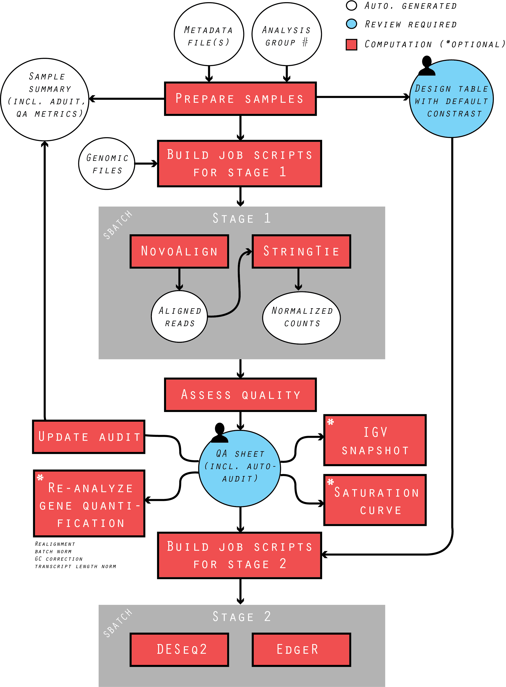

# crypto_pipe.dev

This RNA-seq analysis pipeline is designed for processing data generated from gene perturbation, time series, and multiple level treatment experiments. As illustrated in the following figure, the pipeline modules align Illumina reads, quantify transcriptomic expression, assess sample quality, analyze differential expression (DE), and generate user-friendly reports. Its optional modules provide more thorough quality analysis and help guide future experimental design. The pipeline aim at minimizing human effort in metadata maintenance, sample quality assessment and DE design, while maximizing the versatility in handling complex experiment design. 



### REQUIREMENT

This pipeline uses SLURM workload manager to streamline the RNAseq analysis. The following tools/modules/packages are required and tested on the respective versions:

	SLURM v17.02.6
	novoalign v3.07.00
	stringtie v1.3.3b  
	samtools v1.6
	igv v2.3.60
	java

Python packages:

	pandas v0.20.3
	pysam v0.11.0
	openpyxl v2.5.0
	xlrd v1.1.0

R packages:

	DESeq2 v1.10.1
	EdgeR v3.12.1
	NOISeq v2.14.1

### SETUP
	
1. #### Get ready genome refnereces
	
	Obtain genome (`.fasta`) and gene annotation (`.gtf` or `.gff`) for your strain of interest. For example, `H99.zip` contains the followings for C. neoformans (strain H99):

	```
	├── crNeoH99.fasta
	├── crNeoH99.gtf
	├── gids
	└── H99_GENOME_SUMMARY
	```

2. #### Build index for the reference genome
	
	Make sure the version of aligner used for genome indexing is consistent with that for read alignment. Check aligner manual for details.
	
	```
	ml novoalign/3.07.00
	novoindex <genome>.nix <genome>.fasta 
	```

3. #### Make empty direcotries

	```
	mkdir -p {alignment/{novoalign},expression/{stringtie,stringtie_count_matrix},diffexpr/{deseq2,edger},job_scripts/{lookup_files},log,reports,sequence}
	```

4. #### Install Python packages
	
	If not available, install `pandas`, `pysam`, `pyyaml`, `openpyxl` and `xlrd` as user (the former two are available on HTCF).

	```
	pip install --user <package_name>
	```

5. #### Install R packages in R interactive session

	```R
	> source("https://bioconductor.org/biocLite.R")
	> biocLite("DESeq2")
	> biocLite("edgeR")
	> biocLite("NOISeq")
	```


6. **[Optional]** #### Build IGV genome file for automated IGV snapshot 
	
	1. On your local computer, make a directory `$HOME/igv/<genome>`, and put in genome sequence (`.fasta`) and gene annotation (`.gtf/gff`).
	2. Open IGV app, go to Genomes > Create .genome File, load the files as instructed, and save output at `$HOME/igv/genomes/`.
	3. Copy your locally created genome file and `user-defined-genomes.txt` file at `$HOME/igv/genomes/` to the server directory `$HOME/igv/genomes/`. 
	4. Copy your local directory `$HOME/igv/<genome>` (including an indexing file `.fasta.fai` built by IGV) to the cluster directory `$HOME/igv/<genome>`.
	5. Go to the cluster IGV directory. Edit the following lines in file `$HOME/igv/prefs.properties`:

	```
	DEFINE_GENOME_INPUT_DIRECTORY_KEY=<your_cluster_home_dir>/igv/<genome>
	DEFAULT_GENOME_KEY=<genome>
	```

### USAGE

1. #### Data preparation and pre-alignment QC
	
	1. Make a subdirectory `sequence/run_<#>_samples/` for the batch. Make soft link or copy the reads files to it. Both zipped `*.gz` or unzipped fastq reads files are acceptable.
	2. **[Optional]** Update the thresholds for sample QC in configrue file `tools/qc_config.yaml`.
	3. Prepare samples that will be analyzed together in the same analysis group. This module sifts low-quality sample before alignment, update sample summary sheet, and generates a design table with default contrast group that will be used in DE analysis.

	```
	ml pandas/0.20.3
	python tools/prepare_samples.py -g <group_#> -m metadata/<metadata>.xlsx \
			-d reports/design_table.group_<group_#>.xlsx -w <wildtype> 
	```

2. #### Reads alignment and transcriptomic expression quantification
	
	This module builds the SLURM job script from sample summary. Each job requires 8 CPUs and 24GB of memory. It allows 32 jobs at maximum running in parallel, depending on the available resources (e.g. CPUs and memories). The user may opt to recive email notification when the run fails or completes.
	
	```
	python tools/build_reads_processing.py -g <group_#> -l <gene_list> -i <genome>.nix \
			-r <gene_annotation>.gtf -o job_scripts/<readsproc_job>.sbatch \
			--mail_user <email_address>
	sbatch job_scripts/<readsproc_job>.sbatch
	```

3. #### Quality assessment

	1. #### Assess the quality of each sample 

		The status (in bit form) summarizes the overall quality of each sample. The encoding of the corresponding metric is stored in `tools/qc_config.yaml`. `<markger_genes>` should be tab delimited, if more than one marker is used.
	
	```
	python tools/assess_quality.py -g <group_#> -l <gene_list> -r <max_replicate_#> \
			-w <wildtype> -c <marker_genes> -o reports/sample_quality.group_<group_#>.xlsx
	```

	**[Important]** Proceed to the following steps ii and iii as needed, or jump to step iv.

	2. #### **[Optional]** Assess the efficiency of gene perturbation
	
		Make automated IGV snapshot of the problematic mutant and marker genes. The output snapshot is titled `[<sample>]<gene_mutant>.png`. Two snapshots will be made for double mutant, and so forth.

	```
	ml pysam/0.11.0
	python tools/build_igv_snapshot.py -q reports/sample_quality.group_<group_#>.xlsx \
			-g <gene_annotation>.gtf -gm <genome> \
			-o reports/inefficient_mutation.group_<group_#>/
	sbatch job_scripts/igv_snapshot.sbatch
	```

	3. #### **[Optional]** Make saturation plots for samples grouped by genotype
	
		Each output plot titled `[genotype].png` contains all replicates/samples belonging to the same genotype. `-k` is the stringency to detect features with > k counts.

	```
	ml R/3.2.1
	Rscript tools/make_saturation_curve.r -i <count_matrix>.csv \
			-k 0 -o reports/saturation_curves.group_<group_#>/
	```

	4. #### Manually audit sample quality
	
		Review the QA file `reports/sample_quality.group_<group_#>.xlsx`. If you decide to rescue the sample, record 0 in column MANUAL_AUDIT for the corresponding sample, put your name in USER and your reason of the rescue decision; otherwise, leave it blank.

	5. #### Update audit of sample summary

	```
	python tools/update_audit.py -q reports/sample_quality.group_<group_#>.xlsx
	```

4. #### Differential expression  
	
	This module run differential expression (DE) analysis of each sample contrast group in your design table. The available `<de_module>` are `deseq2` and `edger`, which are both count-based DE tools. The analysis will run on samples sifted by the combined AUTO_AUDIT and MANUAL_AUDIT in QA, if at least one sample is usable in both sub-groups, e.g. in comparison of single mutant to wildtype, we need both mutant and wildtype sub-groups have at least one sample.

	```
	ml R/3.2.1
	Rscript tools/run_DE.r -m <de_module> \ 
		-d reports/design_table.group_<group_#>.xlsx \
		-q reports/sample_quality.group_<group_#>.xlsx \
		-c expression/stringtie_count_matrix/count_matrix.group_<group_#>.csv \
		-o diffexpr/<de_module>/group_<group_#>/
	```

### FILES

1. #### Metadata files
	
	Each metadata file contains experimental and sequencing information about each sample. 

	Mandatory columns:

	* GENOTYPE: Genotype of each sample. The pipeline takes gene name as the deletion strain, and takes gene name appended with `_over` as overexpression. If more than one gene is perturbed, use delimiter `.`, e.g. `gene1.gene2` represents deletion of both gene1 and gene2 
	* REPLICATE: Replicate ID
	* INDUCTION: Date of induction experiment
	* LIBRARY: Date of library prep
	* INDEX: Sequencing index that is unique to a sample in a batch run, e.g. `CTGGTGG`
	* RUN_NUMBER: Run identifier number for associated batch

	Descriptors for the experimental designs: <EXPERIMENT_DESCRIPTORS>. Those descriptors are flexible, for example:
	
	* TREATMENT: Sample treatment, e.g. growth condition, temperature 
	* TIME_POINT: Time after induction to acquire the sample

	QA metrics, but are optional:
	
	* BA
	* TAPESTATION
	* SPIKIN_READS: Spik-in control reads
	# SAMPLE_READS: Total reads

2. #### Sample summary

	Sample summary sheet contains the essential metadata and QA metric after running the pipeline. 

	Metadata columns:

	* GENOTYPE, INDUCTION, LIBRARY, REPLICATE, INDEX, RUN_NUMBER, <EXPERIMENT_DESCRIPTORS>
	* SAMPLE: Unique sample identifier in the entire sample repository
	* FILE: Reads file 
	* GROUP: Analysis group number

	QA columns and sample audits:

	* ST_<QA_METRIC>: Status of each QC metric. 1 indicates the sample DOES NOT flags a problem of the corresponding QA. 
	* AUTO_AUDIT, MANUAL_AUDIT, USER, NOTES record audit (including human decision).


3. #### Sample quality

	Metada columns:

	* GENOTYPE, REPLICATE, SAMPLE

	QA columns:

	* TOTAL_READS: Total read count
	* COMPLEXITY: Percentage of uniquely aligned reads
	* MUT_FOW: Efficiency of gene perturbation
	* <MARKER_FOM>: Efficiency of the replaced drug-marker gene
	* <COV_MED_REPIDs>: Replicate concordance of each combination of replicates, e.g. if you have replicates 1,2,3, there will be COV_MED_REP123, COV_MED_REP12, COV_MED_REP13, COV_MED_REP23. 
	* STATUS: Status score to summarize QA metrics according to `qc_config.yaml`

	Sample audits:

	* AUTO_AUDIT: Auto-generated audit. 1 indicates that the sample DOES NOT pass QA (the tolerance level of rejecting a sample can be adjusted by setting `--auto_audit_threshold` of `assess_quality.py`).
	* MANUAL_AUDIT: Manual audit. Review the QA columns and IGV snapshots for the samples with AUTO_AUDIT of 1. Set MANUAL_AUDIT of 0 if you decide to rescue the sample.
	* USER: Put your name for the rescued sample
	* NOTE: Put your reason of rescue

4. #### Design table

	Metadata columns:

	* GENOTYPE, REPLICATE, SAMPLE
	* <EXPERIMENT_DESCRIPTORS>: Descriptor for your experimental design as input in Metadata file. 

	Design table columns, i.e. subgrouping samples for DE anlaysis:

	Each of those columns has this format `[DESCRIPTOR1:VALUE1-...-DESCRIPTORm:VALUEm]DESCRIPTORm:VALUEmi-VALUEmj`. More specifically, any values with the corresponding descriptors in `[]` are the controlled conditions, and `VALUEmi` vs `VALUEmj` are the sample subsets to be compared as described as `DESCRIPTORm`. For example, `[TREATMENT:37C-TIME_POINT:90m]GENOTYPE:gene1-gene2` standards for comparsing two sample subset with different genotypes `gene1` and `gene2`, while all other experiment conditions are controlled at growth temperature of 37C and acquiring sample 90 minutes after induction. To make your own design subgroup, create a column name as described above, and put 0s and 1s for the respective sample subsets to be compared. 


